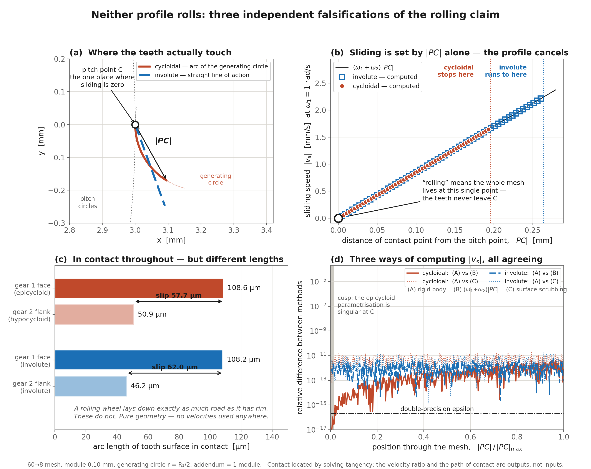

# The Constant Tick

Numerical falsification of the "cycloidal gear teeth roll" claim — Working Paper 0 of a larger project on watch-gear mesh efficiency.

Horological texts, manufacturer pages, and forum consensus justify the cycloidal tooth profile used in watch gearing with a single claim: the teeth *roll* over one another rather than sliding, and rolling means less friction. This is repeated by people who know a great deal about watches. **The load-bearing part of it is false**, and this repository proves it three independent ways, from first principles, with no assumptions borrowed from gear theory.

 The result

Two tooth flanks (an epicycloid face and a hypocycloid flank, generated independently) are handed to a contact solver as bare parametric curves. The solver finds where they touch and how they move — nothing about gear ratios, contact paths, or sliding is assumed going in. All of it comes out the other end as a *result*.

> **On novelty:** the literature search for this project is not yet complete. The
> arc-length identity used in the wheel-and-road test (§ below) is elementary and
> very likely already known — possibly classical. Nothing in this repository is
> claimed as a new result until that search is finished. What *is* claimed is that
> every number here was computed, not assumed, and can be independently checked.

| Quantity | Computed | What it means |
|---|---|---|
| velocity ratio θ₂/θ₁ | −7.5 ± 6×10⁻¹¹ | equals −R₁/R₂ exactly — conjugate action, **measured, not imposed** |
| contact point to (R₁+r, 0) | r ± 9×10⁻¹⁶ | the path of contact **is** the generating circle |
| involute line of action | 20.0000000000° | straight, at exactly the pressure angle |
| conjugate flank at r = R₂/2 | max\|y\| = 0.0 exactly | the two-century-old "straight radial flanks" rule, recovered exactly |
| arc length in contact, gear 1 face | 108.5739 µm | |
| arc length in contact, gear 2 flank | 50.8940 µm | ratio 2.133333, slip 57.68 µm (53% of the longer flank) |
| peak sliding-speed ratio (cycloidal / involute) | 0.741191560 | |
| peak \|PC\| ratio (cycloidal / involute) | 0.741191560 | identical to 6×10⁻¹³ |



## Three independent falsifications:

1. Geometry alone, no velocities Two tooth surfaces in contact for an entire mesh must present equal arc length if they're rolling on one another — a wheel lays down exactly as much road as it has rim. Here they don't: 108.57 µm vs 50.89 µm, a 53% mismatch. This alone falsifies the claim, without computing a single velocity.
2. Sliding speed is nonzero almost everywhere It exceeds 1% of its peak over 99.0% of the mesh for *both* profiles, vanishing only at the single pitch point. Nothing rolls — cycloidal or involute.
3. Cross-check Sliding speed computed three independent ways — rigid-body kinematics, the closed-form identity (ω₁+ω₂)|PC|, and the rate at which each tooth surface scrubs through contact — agree to ~10⁻¹¹. The third computation runs through the actual tooth shape and the first doesn't, so their agreement demonstrates that the profile cancels out of the sliding speed entirely.

So what does the cycloid actually do better? The peak sliding-speed ratio between the two profiles equals the peak-|PC| ratio to 6×10⁻¹³. The cycloid does not slide less per unit of distance from the pitch point — it slides at *exactly* the same rate as the involute. Its entire advantage is that its contact path stays closer to the pitch point. **Contact-path geometry, not rolling.**

 Running it

```bash
pip install -r requirements.txt
python analysis/falsify.py       # runs the experiment, writes results/results.json
python analysis/make_figure.py   # writes results/fig0_no_rolling.png
pytest tests/ -q                 # 19 tests
```

## Method, in more detail

Each flank is generated in its own body frame from the classical rolling construction (epicycloid, hypocycloid, involute), and then **the construction is discarded** — the solver receives only a parametric curve `c(t)` and its derivative. For a point `u` on flank 1, it solves for `(v, θ₁, θ₂)` satisfying:

P₁(u; θ₁) − P₂(v; θ₂) = 0 (the points coincide — 2 equations)
t₁(u; θ₁) × t₂(v; θ₂) = 0 (the tangents are parallel — 1 equation)

θ₂ is a free unknown in this system, not an input — so the velocity ratio is *measured*, and likewise for the path of contact.

## A bug worth documenting

The tangency system has more than one root: the hypocycloid meets the same world point with the same tangent on several laps, and every one of them satisfies the equations to machine-zero residual. An early version anchored the parameter sweep at the cusp (u = 0), where both flanks' derivatives vanish and the tangency condition is singular — every "root" there was numerical noise agreeing to eight decimals. The solver silently picked the wrong lap, and the arc-length result came out 62% wrong with nothing to indicate a problem — not even a large residual.

**Fix:** anchor the sweep in the well-conditioned interior of the mesh (30% of the way through), select the root whose contact point is nearest the pitch point, then sweep outward in both directions with a check that rejects any step where the contact point jumps more than 6× the running median step size — bisecting and retrying rather than silently accepting a jump.

Two regression tests (`test_anchoring_at_the_cusp_silently_picks_the_wrong_branch`, `test_result_is_independent_of_output_grid_density`) lock this in.

## Known limitations

- Below r/R₂ ≈ 0.29 the contact ratio falls under 1 and the drive becomes discontinuous; the closed-form arc-length check is exercised only over the physically valid band r/R₂ ∈ [0.30, 0.50], where it holds at every grid density tested.
- This is Working Paper 0 of a larger project. It establishes the mechanism (contact-path geometry, not rolling); it does not yet compute overall mesh efficiency, tolerance sensitivity, or the friction-optimal generating-circle theorem — those are separate, ongoing work.

## Repository layout

src/meshing.py — the contact solver (flank generation, tangency solving, arc-length machinery)
analysis/falsify.py — runs the falsification experiment end-to-end
analysis/make_figure.py — generates the summary figure
tests/test_no_rolling.py — 19 tests, including two regression tests for the branch-selection bug above
results/ — results.json and fig0_no_rolling.png from the last verified run

## Running it

The easiest way — one command runs the whole pipeline:

```bash
pip install -r requirements.txt
python main.py
```

This regenerates `results/results.json`, `results/run.npz`, and the figure above.

To check correctness instead of regenerating results:

```bash
pytest tests/ -q
```

This should print `19 passed`.

Verified to reproduce identically (all physical quantities agreeing to 15
significant figures) on Windows/Python 3.13 and Linux/Python 3.11 with
different BLAS backends.
